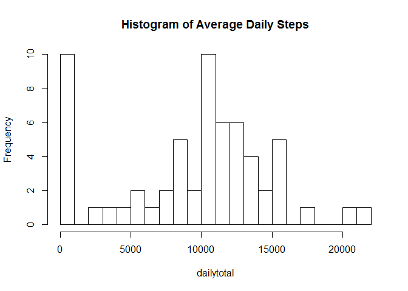
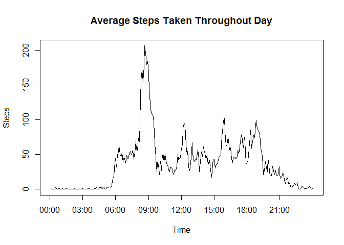
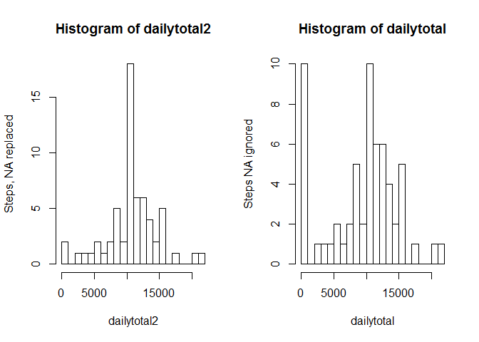
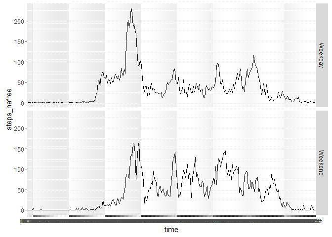

# Reproducible Research: Peer Assessment 1

This is an R Markdown file to complete the course project 1 for Reproducible Research, the 5th course in the Data Science Specialization.  

This project is being submitted by Sarah Lenceski, work starting June 4, 2017.

The project requires the folowing:

Commit a single R markdown file to a forked github account containing:

1 Code for reading in the dataset and/or processing the data  
2.Histogram of the total number of steps taken each day  
3.Mean and median number of steps taken each day  
4.Time series plot of the average number of steps taken  
5.The 5-minute interval that, on average, contains the maximum number of steps  
6.Code to describe and show a strategy for imputing missing data  
7.Histogram of the total number of steps taken each dayafter missing values are imputed  
8.Panel plot comparing the average number of steps taken per 5-minute interval across weekdays and weekends  
9. All of the R code needed to reproduce the results (numbers, plots, etc.) in the report  

## Loading and preprocessing the data

*Start in the repo you have forked/cloned!*

The first step is to read and process the data set. 


```r
unzip(zipfile = "activity.zip", exdir = "mydata")
mydata <- read.csv(file="mydata/activity.csv")
date_time <- seq(ISOdate(2012,10,1, 0,0,0), ISOdate(2012,12,1), by = "5 mins")
date_time <- date_time[1:17568]
time <- strftime(date_time, "%H:%M", tz = "GMT")
mydata <- cbind(mydata, date_time)
mydata <- cbind(mydata, time)
```

## What is mean total number of steps taken per day?
**note: for this part of the assignment, one can ignore missing value**

*Step 1: Calculate the total number of steps taken per day.*


```r
dailytotal <- tapply(mydata$steps, mydata$date, sum, na.rm = TRUE)
```

*Step 2: Make a histogram of the daily totals. I'm choosing to increase the number of bins shown*


```r
hist(dailytotal, breaks = 25)
```



*Step 3: Calculate the mean and the median of the daily totals:*

```r
mean(dailytotal)
```

```
## [1] 9354.23
```

```r
median(dailytotal)
```

```
## [1] 10395
```

## What is the average daily activity pattern?

*Part 1: Make a time series plot of the 5min interval averaged across all days:*

Start by creating vector of the average at each time with a tapply function

```r
dayavg <- tapply(mydata$steps, INDEX = as.factor(mydata$time), FUN = mean, na.rm = TRUE)
```

Then plot it


```r
plot(dayavg, type ="l", xlab = "Time", xaxt = "n", main = "Average Steps Taken", ylab = "Steps")
axis(1, at = seq(0, 287, by = 36), lab =names(dayavg[seq(1,288, by = 36)]))
```




*Part 2: Which 5 min interval on average contains the max number of steps?*


```r
which.max(dayavg)
```

```
## 08:35 
##   104
```

## Imputing missing values
*Part 1: Calculate the total number of missing values in the data set:*

The total number of missing items is:

```r
sum(is.na(mydata$steps))
```

```
## [1] 2304
```

This is out of 17,568 observations. So the percentage of missing data, would be:

```r
mean(is.na(mydata$steps))
```

```
## [1] 0.1311475
```

*Part 2:Devise a strategy for filling in the missing values*

steps: 
1. create vector of positions of NA using which() and the is.na() functions

```r
indexvector <- which(is.na(mydata$steps))
```
2. FInd times at each position

```r
indextimes <- mydata$time[which(is.na(mydata$steps))]
```
3. find average time from dayavg

```r
indextimeavg <- dayavg[mydata$time[which(is.na(mydata$steps))]]
```
4.Use the replace() function 

*Part 3: create a new data set with values replaced*

```r
steps_nafree <- replace(mydata$steps,indexvector,indextimeavg)

mydata_nafree <- cbind(steps_nafree, mydata[,-1])
```

*Part 4: Create a new histogram and calculate the mean/median with the new data set. Compare to the first data set.*


```r
dailytotal2 <- tapply(mydata_nafree$steps_nafree, mydata_nafree$date, sum)
par(mfrow =c(1,2))
hist(dailytotal2, breaks = 25, ylab = "Steps, NA replaced")
hist(dailytotal, breaks = 25, ylab ="Steps NA ignored")
```



Comparing the mean and median of the original (NA ignored, dailytotal)
 to the new data set (dailytotal2), we see that the new mean is 1412 steps higher and the new median is 371 steps greater.
 

```r
mean(dailytotal2)
```

```
## [1] 10766.19
```

```r
mean(dailytotal)
```

```
## [1] 9354.23
```

```r
median(dailytotal2)
```

```
## [1] 10766.19
```

```r
median(dailytotal)
```

```
## [1] 10395
```

## Are there differences in activity patterns between weekdays and weekends?
*Part 1: Create a new factor variable with two levels: weekday and weekend*
**Use the weekdays() function**
**Use data set with NA replaced**

```r
day <- weekdays(date_time)
day[day == "Saturday"| day == "Sunday"] <- "Weekend"
day[day != "Weekend"] <- "Weekday"
day <- as.factor(day)
mydata_nafree <- cbind(mydata_nafree, day)
```
*Part 2: Make a panel plot containing a time series plot(type = "l") across weekdays and weekends.*

```r
library(ggplot2)
```

```
## Warning: package 'ggplot2' was built under R version 3.2.5
```

```r
g <- ggplot(data = mydata_nafree, aes(y = steps_nafree, x = time))
g +stat_summary(fun.y = mean, geom = "line", group = 1)+facet_grid(day~.)
```


